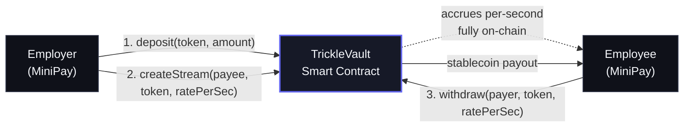
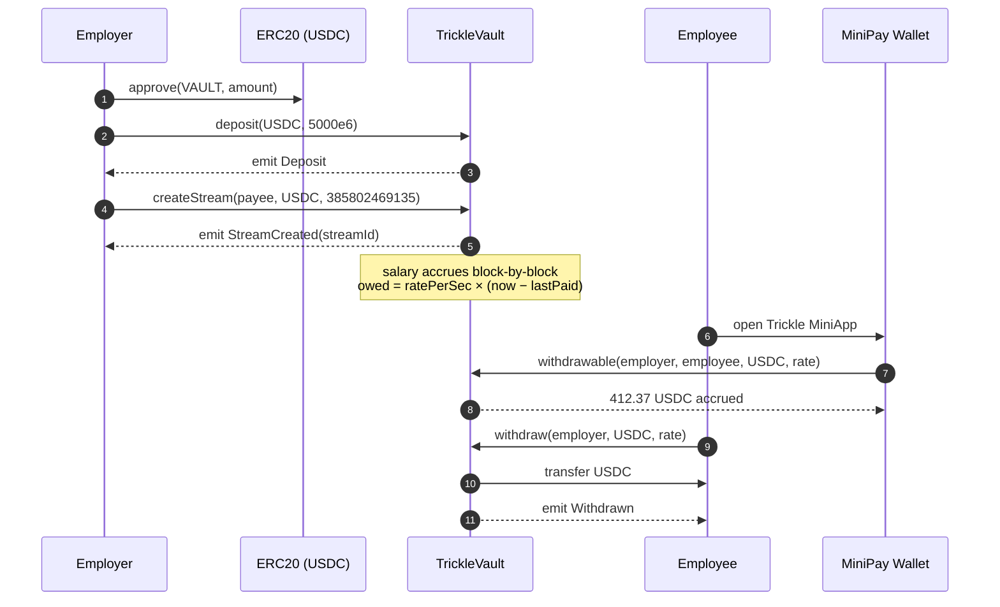
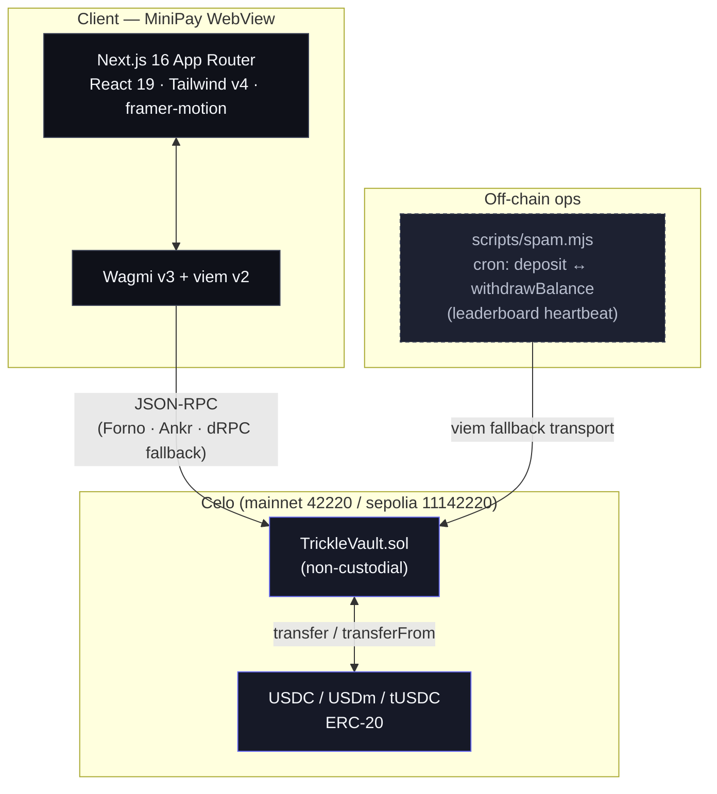
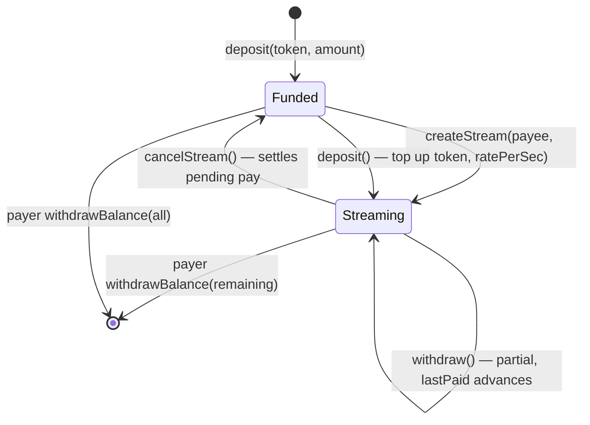
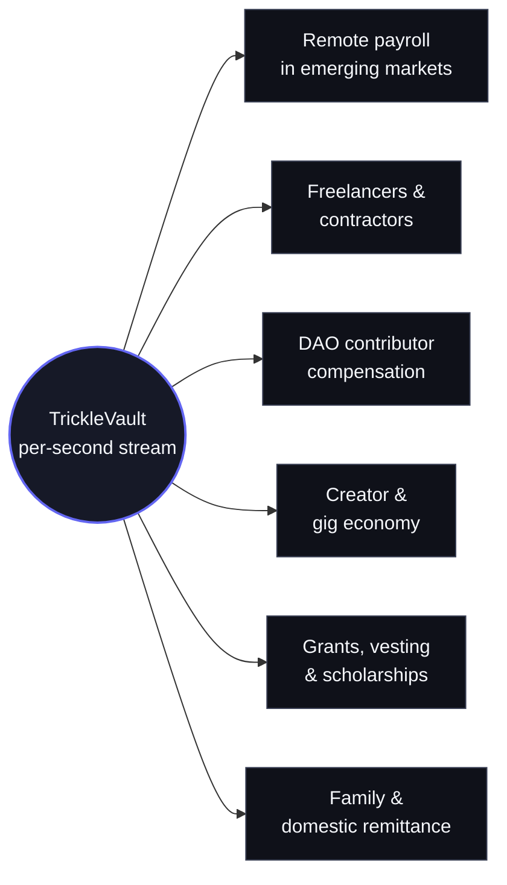

<div align="center">
  

  <h1>Trickle</h1>

  <p><strong>Real-time payroll streaming on Celo. Get paid every second.</strong></p>

  <p>
    <a href="https://celoscan.io/address/0x8a3e5d16F088A1D96f554970e5eED8468e7ddc05">
      
    </a>
    <a href="https://sepolia.celoscan.io/address/0x42cADdd47E795A6e04d820A6c140AF04159C7542">
      
    </a>
    
    
    
    
  </p>

  <p>
    <a href="#-live-deployments">Deployments</a> ·
    <a href="#-architecture">Architecture</a> ·
    <a href="#-quick-start">Quick start</a> ·
    <a href="#-smart-contract-reference">Contract API</a> ·
    <a href="#-roadmap">Roadmap</a>
  </p>
</div>

---

## Overview

**Trickle** is a non-custodial payroll-streaming protocol built natively for the **Celo** stablecoin economy and surfaced as a **MiniApp inside MiniPay**. Employers deposit stablecoins once, open a per-second salary stream to each employee, and the employee can withdraw their accrued earnings at any moment — no payday, no batch processing, no intermediaries.

It is heavily inspired by [LlamaPay](https://llamapay.io/), but ships where LlamaPay does not: on Celo, in front of **14M+ MiniPay users**, with sub-cent withdrawal fees and gas-payable-in-stablecoins.

> **The thesis** — Salary should accrue at the same cadence people actually live: by the second, not by the month.

---

## The problem

| Today | Why it hurts |
|---|---|
| Salary lands once or twice a month | Workers in emerging markets carry weeks of liquidity risk |
| Crypto payroll lives on L1 / L2s with high fees | A $0.50 withdrawal makes no sense if gas is $3 |
| Existing streaming protocols (LlamaPay, Sablier) **are not on Celo** | The chain with the best stablecoin UX has zero payroll-streaming infra |
| Web3 payroll dApps assume desktop + browser wallets | Most of the target market only has a phone |

Celo solves the cost and distribution side. Trickle is the missing application layer.

---

## How it works



1. **Employer** deposits stablecoins into the `TrickleVault` and opens a stream with a flat per-second rate.
2. **The vault** records `lastPaid` and accrues `amountPerSec * elapsed` of salary on every block — no oracle, no keeper, no off-chain cron.
3. **Employee** can call `withdraw(...)` anytime to pull whatever has accrued so far. If the vault has run dry, the call pays out whatever is available and advances `lastPaid` proportionally so nothing is lost.

The whole accounting model is one struct and three storage maps. It is intentionally boring — boring is what payroll should be.

---

## End-to-end sequence



---

## System architecture



---

## Repository layout

This is a **monorepo** with three independent packages:

```
celo_hackaton/
├── sc_trickle/         Foundry workspace — Solidity contracts, tests, deploy scripts
│   ├── src/TrickleVault.sol
│   ├── script/Deploy.s.sol
│   ├── script/DeployMockToken.s.sol
│   └── test/...
│
├── fe_trickle/         Next.js 16 MiniApp (React 19, Tailwind v4, wagmi v3, viem v2)
│   ├── app/            App Router routes:
│   │                     /, /home,
│   │                     /employer, /employer/create, /employer/batch,
│   │                     /employee, /employee/payslip, /employee/request,
│   │                     /pay
│   ├── components/     UI primitives, dashboard surfaces, ProfileSheet,
│   │                   ThemeProvider, TransactionHistorySection
│   ├── config/         chains.ts · contracts.ts · tokens.ts · wagmi.ts
│   ├── hooks/          useChain · useDeposit · useMiniPay · useTransactionHistory
│   └── lib/            invoiceLink.ts (payment request URLs) · parseStream.ts
│                       (+ vitest tests in __tests__/)
│
├── scripts/            Node CLI — onchain heartbeat that keeps Trickle on the
│                       Celo Proof-of-Ship leaderboard (deposit ↔ withdrawBalance loop)
│
├── logo.png
└── README.md           ← you are here
```

Each package has its own README with package-level docs:
- [`sc_trickle/README.md`](./sc_trickle/README.md) — full Foundry workflow, deploy + verify, cast cheatsheet
- [`scripts/README.md`](./scripts/README.md) — heartbeat tuning + reliability notes

---

## Live deployments

### Celo Mainnet (chain `42220`)

| | |
|---|---|
| `TrickleVault` | [`0x8a3e5d16F088A1D96f554970e5eED8468e7ddc05`](https://celoscan.io/address/0x8a3e5d16F088A1D96f554970e5eED8468e7ddc05) |
| Deployer | `0x0a1518F64C2e2F41bcba6f6910cA07131C2A7c0a` |
| Block | `64796163` |
| Deploy gas | 1,180,698 gas — `0.059 CELO` paid |
| Verification | Verified on Celoscan |
| Primary token | **USDC** — [`0xcebA…118C`](https://celoscan.io/address/0xcebA9300f2b948710d2653dD7B07f33A8B32118C) (6 decimals) |

### Celo Sepolia (chain `11142220`)

| | |
|---|---|
| `TrickleVault` | [`0x42cADdd47E795A6e04d820A6c140AF04159C7542`](https://sepolia.celoscan.io/address/0x42cADdd47E795A6e04d820A6c140AF04159C7542) |
| USDC | [`0x01C5…C44E`](https://sepolia.celoscan.io/address/0x01C5C0122039549AD1493B8220cABEdD739BC44E) (6 decimals) |
| USDm (Mento Dollar) | [`0xEF4d…bC80`](https://sepolia.celoscan.io/address/0xEF4d55D6dE8e8d73232827Cd1e9b2F2dBb45bC80) (18 decimals) |
| tUSDC (mock w/ public `mint()`) | set via `NEXT_PUBLIC_MOCK_TOKEN_ADDRESS` |

> Celo Alfajores was sunset at the end of 2025. Trickle targets Celo Sepolia for testing.

---

## Smart contract reference

`TrickleVault` is a single, dependency-light Solidity contract. The full source is in [`sc_trickle/src/TrickleVault.sol`](./sc_trickle/src/TrickleVault.sol).

### Stream lifecycle



### Public API

```solidity
// ── Employer ──────────────────────────────────────────────
function deposit(address token, uint256 amount) external;
function withdrawBalance(address token, uint256 amount) external;
function createStream(address payee, address token, uint216 amountPerSec) external;
function cancelStream(address payee, address token, uint216 amountPerSec) external;

// ── Employee ──────────────────────────────────────────────
function withdraw(address payer, address token, uint216 amountPerSec) external;

// ── Views ─────────────────────────────────────────────────
function withdrawable(address payer, address payee, address token, uint216 amountPerSec)
    external view returns (uint256);
function getStream(bytes32 streamId) external view returns (Stream memory);
function getPayerStreamIds(address payer) external view returns (bytes32[] memory);
function getPayeeStreamIds(address payee) external view returns (bytes32[] memory);
function getStreamId(address payer, address payee, address token, uint216 amountPerSec)
    external pure returns (bytes32);
```

### Events

| Event | Emitted when |
|---|---|
| `Deposit(payer, token, amount)` | Employer funds the vault |
| `BalanceWithdrawn(payer, token, amount)` | Employer pulls back unstreamed balance |
| `StreamCreated(streamId, payer, payee, token, amountPerSec)` | New stream opened |
| `StreamCancelled(streamId, payer, payee, token)` | Stream closed; pending pay settled |
| `Withdrawn(streamId, payee, payer, amount)` | Employee claims accrued earnings |

### Per-second rate math

```
amountPerSec = monthlySalary × 10^decimals / 2_592_000

# $1,000/month in USDC (6 decimals):
amountPerSec = 1_000 × 10^6 / 2_592_000 ≈ 385_802 (wei/sec)
```

The contract clamps payouts at the available vault balance — a stream never reverts when the employer underfunds; it just pays whatever is there and advances `lastPaid` proportionally so the employee can claim the rest after a top-up.

---

## Tech stack

| Layer | Tech |
|---|---|
| **Chain** | Celo Mainnet (42220) · Celo Sepolia (11142220) |
| **Smart contracts** | Solidity `^0.8.20`, **Foundry** (forge / cast / anvil) |
| **Frontend** | Next.js 16 (App Router), React 19, TypeScript 5, Tailwind v4 |
| **Web3 client** | wagmi v3 + viem v2, RPC fallback across Forno · Ankr · dRPC |
| **Animation / UI** | framer-motion 12, lucide-react, Spline (hero) |
| **Wallet** | MiniPay (in-WebView injected provider) |
| **Heartbeat** | Node 20 + viem (`scripts/spam.mjs`) |
| **Deployment** | Vercel (frontend), Celoscan-verified (contract) |

---

## Quick start

### Prerequisites
- **Node.js 20+** and **npm**
- **Foundry** (`curl -L https://foundry.paradigm.xyz | bash && foundryup`)
- A wallet with a sliver of CELO for gas (or use Sepolia + the [Celo faucet](https://faucet.celo.org))

### 1. Clone

```bash
git clone https://github.com/<your-username>/trickle.git
cd trickle
```

### 2. Smart contracts

```bash
cd sc_trickle
forge install                      # pull forge-std
forge build                        # compile
forge test -vvv                    # full test suite (no internet needed)

cp .env.example .env               # add PRIVATE_KEY + CELOSCAN_API_KEY
forge script script/Deploy.s.sol --rpc-url celo-sepolia --broadcast --verify -vvvv
```

Full Foundry recipe (mainnet deploy, cast cheatsheet, gas report) lives in [`sc_trickle/README.md`](./sc_trickle/README.md).

### 3. Frontend

```bash
cd fe_trickle
npm install
npm run dev                        # http://localhost:3000
```

`config/chains.ts` already points at the live mainnet vault. Override with env vars if you redeploy:

```dotenv
NEXT_PUBLIC_TRICKLE_VAULT_ADDRESS_MAINNET=0x...
NEXT_PUBLIC_TRICKLE_VAULT_ADDRESS_SEPOLIA=0x...
NEXT_PUBLIC_MOCK_TOKEN_ADDRESS=0x...   # tUSDC faucet token on Sepolia
```

### 4. (Optional) heartbeat script

Keeps the protocol's onchain footprint warm for the Celo Proof-of-Ship leaderboard.

```bash
cd scripts
npm install
cp .env.example .env               # PRIVATE_KEY, VAULT_ADDRESS, TOKEN_ADDRESS, CHAIN
npm run spam
```

See [`scripts/README.md`](./scripts/README.md) for tuning knobs.

---

## MiniApp surfaces

| Route | Role | Purpose |
|---|---|---|
| `/` | — | Onboarding · brand pill, hero illustration, primary CTA |
| `/home` | both | Role select (Employer / Employee) after wallet connect |
| `/employer` | payer | Vault overview · token tabs · 3-action row · active streams |
| `/employer/create` | payer | New stream form — payee, token, monthly rate, review |
| `/employer/batch` | payer | **Batch payroll** — add many payees in one flow (CSV import + multi-stream review) |
| `/employee` | payee | Live withdrawable counter · area chart · withdraw all |
| `/employee/payslip` | payee | **Payslip view** — earnings history, tx receipts, **PDF export** |
| `/employee/request` | payee | **Payment request link** — generate shareable URL for one-off invoices |
| `/pay` | payer | Landing for inbound request links — parsed amount, token, payee, one-click confirm |

The visual system is a dark-indigo SaaS aesthetic (background `#0A0B14`, surfaces `#161927`, accent `#6366F1`), tuned for restraint — Stripe / Linear / Ramp as references, not generic web3 dApps. **Light/dark theme** toggle preserved via `ThemeProvider`.

---

## Use cases

Trickle is a single primitive — a per-second stream of an ERC-20 — but that primitive maps cleanly onto a wide set of real-world payment patterns. The MiniPay surface widens this further: anyone with a phone and a Celo address is reachable.



### 1. Remote payroll in emerging markets
**Who:** companies hiring engineers, designers, support staff in LATAM / Africa / SEA where banking is slow or expensive.
**Why Trickle:** worker is paid every second in USDC, withdraws to MiniPay anytime, no IBAN, no SWIFT, no FX desk. Sub-cent gas means even a $10 mid-week withdrawal makes economic sense.

### 2. Freelancers & long-running contracts
**Who:** independent developers, designers, copywriters on month-long engagements.
**Why Trickle:** replaces the awkward 50% upfront / 50% on delivery dance. Client opens a stream for the engagement window; freelancer claims earned value continuously. If the relationship ends, `cancelStream` settles whatever was owed up to that second — no disputes about partial work.

### 3. DAO contributor compensation
**Who:** protocol DAOs, guilds, working groups paying core contributors from a multisig treasury.
**Why Trickle:** one Safe → many streams. Contributors see a live "earned this month" counter. Treasury runway becomes legible (`balance / totalPaidPerSec` = seconds of payroll left). Cancellation is non-punitive — pending pay always settles before the stream closes.

### 4. Creator economy & gig work
**Who:** content platforms paying creators, agencies paying drivers / couriers / micro-task workers.
**Why Trickle:** salary that mirrors how creators actually live (daily cash needs, not monthly cycles). MiniPay's 14M+ install base means the worker doesn't install anything new — the wallet is already there.

### 5. Grants, scholarships & token vesting
**Who:** ecosystem foundations, hackathon sponsors, universities, DAO grant programs.
**Why Trickle:** a grant becomes a stream with a fixed end date instead of a milestone-gated PDF chase. Recipients pull funds as they need them. The same primitive doubles as a vesting schedule for advisors or early team — linear, transparent, revocable.

### 6. Family & domestic remittance
**Who:** workers abroad sending continuous support to family; households paying caregivers, tutors, domestic help.
**Why Trickle:** instead of a chunky monthly transfer with high FX + remittance fees, the recipient receives a continuous USDC stream and withdraws as they need cash. This is the use case Celo + MiniPay was arguably built for.

> Across all six, the protocol is identical. The differentiation is **distribution + cost**: MiniPay puts streams in front of users who already have the wallet, and Celo's fee model makes frequent small withdrawals viable.

---

## Why Celo

| | |
|---|---|
| **Native stablecoins** | cUSD ships at the protocol level; USDC + USDT live as well-known ERC-20s |
| **Sub-cent fees** | A frequent-withdrawal product is unviable on a $3-gas chain |
| **MiniPay distribution** | 14M+ users with a pre-installed wallet — no acquisition cliff |
| **Pay gas in stablecoins** | Users never need to hold CELO to interact |
| **Fast finality** | ~5s block times feel close enough to "real-time" for streaming UX |
| **EVM-equivalent** | Solidity, Foundry, viem, wagmi — zero new tooling to learn |

---

## Trickle vs LlamaPay

| | LlamaPay | **Trickle** |
|---|---|---|
| Per-second salary streaming | Yes | **Yes** |
| Deployed on Celo | No | **Yes — mainnet & sepolia** |
| MiniPay integration | No | **Yes** |
| Mobile-first surface | Web only | **MiniApp** |
| Native cUSD support | No | **Yes** |
| Sub-cent withdraw fees | Chain-dependent | **Yes (Celo)** |
| Gas in stablecoins | No | **Yes (Celo fee abstraction)** |

LlamaPay validated the streaming-payroll category. Trickle ships it where the next billion users actually are.

---

## Roadmap

### Shipped (Proof of Ship · April – May 2026)
- [x] `TrickleVault` deployed and Celoscan-verified on **Celo Mainnet**
- [x] Sepolia deployment + mock USDC faucet for testing
- [x] Per-second accrual, partial-funding payout, cancel-with-settlement
- [x] Next.js 16 MiniApp — onboarding, employer + employee dashboards
- [x] wagmi v3 / viem v2 with multi-RPC fallback
- [x] `talent.app` Proof-of-Ship verification meta tag
- [x] **Batch payroll** — add many payees in one review screen (`/employer/batch`)
- [x] **Payslip view + PDF export** for employees (`/employee/payslip`)
- [x] **Payment request links** — employee generates a shareable URL; employer
      lands on `/pay` with the amount, token, and recipient pre-filled
- [x] **Transaction history** with on-chain receipts and explorer links
- [x] **Light / dark theme** toggle persisted across sessions
- [x] Multi-token support: **USDm** (Mento Dollar, 18 decimals), USDC, tUSDC
- [x] Vitest unit tests for `invoiceLink`, `parseStream`, `useTransactionHistory`

### Next
- [ ] Stream scheduling — `startTime` to begin a stream at a future date
- [ ] Low-balance + payment-received push notifications
- [ ] Multi-sig / Safe support for company treasuries
- [ ] Onchain payslip NFT (ERC-721 receipt per withdrawal)
- [ ] Fiat off-ramp inside the MiniApp
- [ ] Analytics: burn rate, runway, employee earnings history

---

## Example: Company ABC pays 5 employees

> 5 engineers, $1,000/month each, paid in USDC on Celo Mainnet.

| Step | Action | Detail |
|---|---|---|
| 1 | `deposit` | Company funds vault with **5,000 USDC** |
| 2 | `createStream` × 5 | Each at `385_802 wei/sec` (≈ $1k/mo in 6-decimal USDC) |
| 3 | Mid-month | Engineer opens MiniPay → sees **$497.31** accrued |
| 4 | `withdraw` | Tx settles in ~5s, gas paid in cUSD, fee `< $0.01` |
| 5 | End of month | Remaining $502.69 still claimable; or top-up & continue |

No payday. No payroll calendar. Just salary that exists in real time.

---

## Team

- **Ezra Kristanto Nahumury** — Full-stack & smart contracts ([@ezra-kn](https://github.com/))

---

## Links

| | |
|---|---|
| Mainnet contract | [celoscan.io/address/0x8a3e…dc05](https://celoscan.io/address/0x8a3e5d16F088A1D96f554970e5eED8468e7ddc05) |
| Sepolia contract | [sepolia.celoscan.io/address/0x42cA…7542](https://sepolia.celoscan.io/address/0x42cADdd47E795A6e04d820A6c140AF04159C7542) |
| Proof of Ship | [talent.app/~/earn/celo-proof-of-ship](https://talent.app/~/earn/celo-proof-of-ship) |
| Celo docs | [docs.celo.org](https://docs.celo.org/) |
| MiniPay docs | [docs.celo.org/build-on-minipay](https://docs.celo.org/developer/build-on-minipay/overview) |
| LlamaPay (reference) | [llamapay.io](https://llamapay.io/) |
| Telegram | [t.me/proofofship](https://t.me/proofofship) |

---

## License

[MIT](./LICENSE) — open source, as required by Celo Proof of Ship eligibility.
